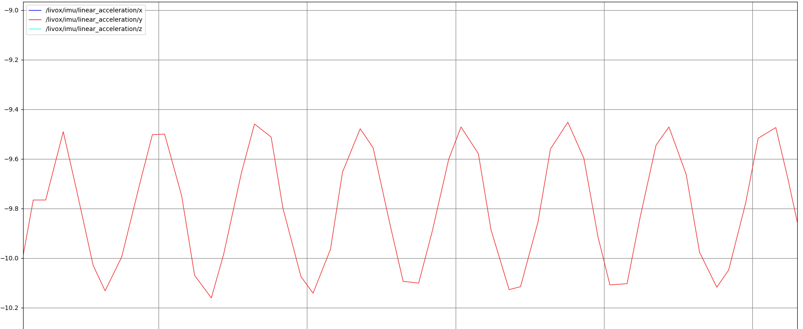

# TUP2023-Sentry-Nav
沈阳航空航天大学TUP战队2023年哨兵导航模块

## 作者: 顾昊
## 1. 简介
该模块为哨兵导航模块，负责进行3维点云至2.5D转换,激光里程计(LIO),重定位，路径规划，让哨兵在比赛场地内可以进行自身的定位与路径规划.
该分支为LIO分支.

## 2.项目结构
├── dll  重定位模块  
├── FAST_LIO  FAST-LIO激光里程计  
├── grid_map  grid_map库，用于生成2.5D高程地图  
├── imu_tools  IMU滤波库，用于提供位姿  
├── LICENSE  协议   
├── LIO-SAM  LIO-SAM激光里程计  
├── livox_ros_driver2  livox驱动  
├── navigation2  nav2库，用于导航  
├── octomap_mapping PCD转八叉树地图    
├── pic  图像  
└── README.md  文档    

## 3.软件设计

导航部分软件大致可分为四块:
- `Drivers`: livox_ros_driver2, imu_tools，基本的设备驱动节点，图上未画出
- `LIO`: FAST-LIO,LIO-SAM,dll，负责进行LIO和重定位以确定机器人位置
- `GridMap`: grid_map,负责将点云转换为2.5D高程地图，供nav2导航使用
- `Nav2`: nav2，本仓库的核心，负责进行最终的导航

### 3.1 激光里程计
激光里程计部分我们提供了FAST-LIO和LIO-SAM的实现，使用者可以自行选择，我们经过测试总结了两种算法的特点一些特点，总结在下面对比供对比参考:
||FAST-LIO|LIO-SAM|
|---|---|---|
|IMU|对陀螺仪数据质量要求相对较低|预积分基于gtsam库实现，对陀螺仪数据质量要求高，可能会出现IMU积分数值不稳定程序崩溃的危险|
|回环检测|无|有，但退化场景下不推荐使用，存在飘飞可能|
|算力需求|相对较低|相对较高|

总的来说，如果需要使用LIO-SAM,务必确保陀螺仪数据质量得到保证.

Mid360开机后振动大，对陀螺仪数据有较大影响(约为25hz正弦波，幅值±0.3m/s^2，可能是内部机械结构旋转所致).可适当进行数据处理或者使用外接陀螺仪以提高定位精度.

