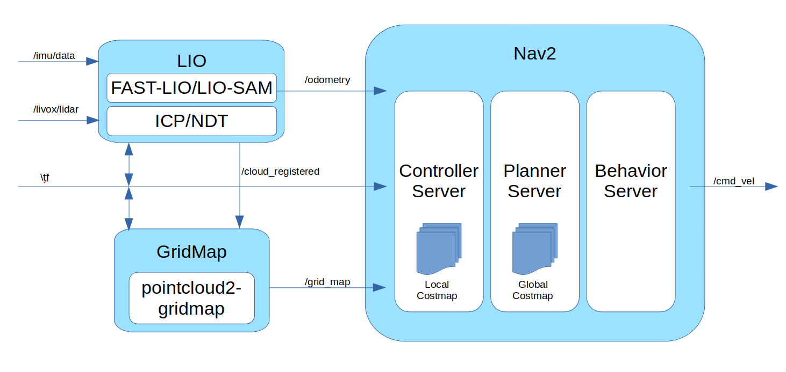

# TUP2023-Sentry-Nav
沈阳航空航天大学TUP战队2023年哨兵导航模块

## 作者: 顾昊
## 1. 简介
该模块为哨兵导航模块，负责进行3维点云至2.5D转换,视觉里程计(VIO)，回环检测(loop fusion)，路径规划，让哨兵在比赛场地内可以进行自身的定位与路径规划.

## 2. 各子模块简介
### 2.1 VINS-Fusion
VINS(Visual-Inertial Systems)是一个2017年由香港科技大学开源的一个VIO算法框架.其中VINS-Fusion可用于使用双目相机+IMU构建VIO，并可以使用其中的loop_fusion进行回环检测.
我们使用VINS-Fusion接收`sensor_msgs/Imu`类型的消息作为IMU数据，`sensor_msgs/Image`类型的消息作为左右目图像，构建VIO并用于导航.
### 2.2 grid_map
grid_map库是一个带有ROS接口的C++库，用于管理具有多个数据层的二维网格地图.它专为移动机器人制图而设计，用于存储高程、方差、颜色、表面法线、可通过性等数据.
我们使用GridMap库,将`sensor_msgs/PointCloud2`类型的3D点云进行转化变为2.5D的栅格地图，并计算各栅格Z轴坐标与可通过性，最后作为`grid_map_msgs/GridMap`消息发送.
### 2.3 Nav2
Nav2基于ROS 2构建，是ROS 1 Navigation Stack的继任者。它提供了一个更灵活、可扩展和易于使用的导航框架，支持多种导航应用程序和算法，如全局路径规划、局部障碍物避难、动态地图更新等，为ROS2用户提供了一套完整的导航解决方案.我们编写了基于GridMap实现的costmap plugin并与Nav2进行集成，实现了我们的导航功能。

## 3. 软件设计
### 3.1 SLAM
在2023赛季伊始，我们仔细对比了几种较为常见的SLAM方案，并分析了他们的优缺点.
|导航方案|设备|典型价格|优点|缺点|
|---|---|---|---|---|
|2D LSLAM|2D激光雷达|2000-4000|开发简单|多适用于平面导航，上坡存在困难|
|VSLAM|双目相机|2000-3000|可提供3维里程计信息|重定位较为困难|
|3D LSLAM|3D激光雷达|4000+|可提供3维里程计信息|价格昂贵|

根据实验室已有资源，我们对以上三种方案进行了一定限度的实验.
#### 3.1.1 2D LSLAM
`设备`:SLAMTEC RPLIDARA2 + WT61PCTTL IMU  
`建图算法`:Cartographer  
`里程计`:laser_scan_matcher  
`定位\重定位算法`:AMCL  

2D LSLAM是RMUA中较为常用的定位方案，经过我们的实验，该方法也确实展现出了较强的鲁棒性.但较为遗憾的是,该方法主要只适用于2维环境，对于RMUC这种复杂的2.5D环境不甚适用，如若在比赛中使用该方法，可能无法进行自主导航上坡或类似的行为.因此该方法不应被选为主要方案，只可发挥辅助作用.
#### 3.1.2 3D LSLAM
`设备`:Livox Mid-70  
`建图算法`:LIO-Livox   
`里程计`:LIO-Livox  

3D LSLAM具有较为优秀的建图精度.对RM场景也十分友好.但缺点也很明显，就是价格较为昂贵.在我们在2022下半年测试时仍旧没有较为便宜的全向三维激光雷达，因此我们选用的是Mid-70进行测试.
Mid-70的建图精度相当优秀，但缺少内置IMU，里程计无法使用IMU数据.最重要的是该雷达的FOV相当受限，只有70度，这会使得导航相当难以处理车辆侧方的障碍，极易出现擦边的情况.
受限于捉襟见肘的资金，我们只能忍痛放弃了3D LSLAM方案.(Mid360的诞生完全颠覆了该状况.事后诸葛的说，Mid360出现后，LIO方案应该是目前RM环境下的最佳选择)
#### 3.1.3 VSLAM
`设备`:Intel Realsense D435  
`建图算法`:octomap_mapping  
`里程计`:VINS-Fusion  
`定位\重定位算法`:VINS-Fusion(loop fusion)  

VSLAM相较于3DSLAM而言效果略逊一筹，且重定位的问题仅靠回环检测较难以解决.但是深度相机的价格相对于高端的3维激光雷达而言较为低廉.且也可以获取点云信息
.可以处理上坡的情况.视角的问题可以通过使用广角镜头来一定程度上缓解.

综上所属,我们里程计最后采取了VSLAM的方案.在联盟赛的表现也证明该方案有一定鲁棒性,但无法处理传感器长时间高速自旋的情况，此时里程计可能飘飞.

### 3.2 路径规划
Nav2的路径规划分为全局规划和局部规划两部分,全局规划的算法一般影响不大,真正进行运动控制的是局部规划局部规划器.
Nav2中运用较多的局部路径规划器是DWA和TEB.DWA的优化目标内并没有时间约束项,运动时间可能较长，因此我们换用了TEB规划器.
